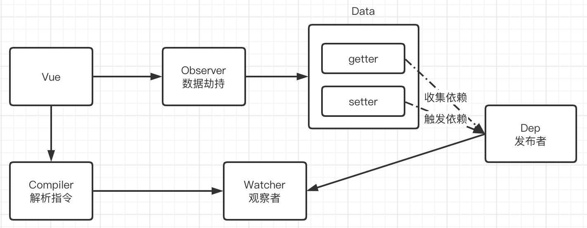

Vue.js 源码剖析-响应式原理、虚拟 DOM、模板编译和组件化

####一、简答题

1、请简述 Vue 首次渲染的过程。
>答：
>   - 首先是对 Vue 这个构造函数进行初始化，挂载实例成员和静态成员
>   - 然后我们在 new Vue({ ... }) 的时候其实是触发了 this._init() 方法
>   - 如果 new Vue({ el: '#app' }) 中的 el 不为空，则会触发 vm.$mount() 方法
>   - 因为我们运行的是带编译器的 web 版本，所以执行 src/platforms/web/entry-runtime-with-compiler.js 中定义的 $mount() 方法
>       - 首先获取 el 对应的 DOM，
>       - 根据有无 render 选项，分两种情况
>           - 如果 无 render
>               - 获取一个 template (可能是 template 选项，也有可能是 el 的 getOuterHTML())，调用 compileToFunctions() 方法，生成 render() 函数并挂载到 options.render 上
>               - 触发 有 render 的步骤
>           - 如果 有 render
>               - 调用 src/platforms/web/runtime/index.js 中定义的 $mount() ，执行 mountComponent() 方法
>               - 调用 src/core/instance/lifecycle.js v 中定义的 mountComponent() 方法
>               - 触发 beforeMount 生命周期钩子
>               - 定义 updateComponent() 方法，
>               - 创建一个 Watcher 实例，将上一步定义的 updateComponent() 方法传递给 Watcher 实例
>               - 触发 mounted 生命周期钩子
>               - 返回 vm
>           - 上诉 1，2 步骤皆会创建 Watcher 实例
>               - 创建 Watcher 实例后会触发一次 watcher.get()
>               - get() 会调用当参数传入的 updateComponent() 方法，
>               - 该方法会去执行 vm._update(vm._render(), hydrating)
>               - vm._render() 取 vm.$options.render() 生成 VDOM 并返回
>               - vm._update() 执行更新，将 VDOM 转换成 真实 DOM
>   - 初始化完成

2、请简述 Vue 响应式原理。

>答：
>   - Vue.js 是一款 MVVM 框架，数据模型仅仅是普通的 JavaScript 对象，但是对这些对象进行操作时，却能影响对应视图，它的核心实现就是「响应式系统」。 Object.defineProperty，Vue.js 就是基于它实现「响应式系统」的。
>   - getter 跟 setter 在 init 的时候通过 Object.defineProperty 进行了绑定，它使得当被设置的对象被读取的时候会执行 getter 函数，而在当被赋值的时候会执行 setter 函数。
>   - 当 render function 被渲染的时候，因为会读取所需对象的值，所以会触发 getter 函数进行「依赖收集」，「依赖收集」的目的是将观察者 Watcher 对象存放到当前闭包中的订阅者 Dep 的 subs 中。形成如下所示的这样一个关系。

>   - 在修改对象的值的时候，会触发对应的 setter， setter 通知之前「依赖收集」得到的 Dep 中的每一个 Watcher ，告诉它们自己的值改变了，需要重新渲染视图。这时候这些 Watcher 就会开始调用 update 来更新视图，当然这中间还有一个 patch 的过程以及使用队列来异步更新的策略。
>   - 小结
>       - 首先在 observer 的过程中会注册 get 方法，该方法用来进行「依赖收集」。在它的闭包中会有一个 Dep 对象，这个对象用来存放 Watcher 对象的实例。其实「依赖收集」的过程就是把 Watcher 实例存放到对应的 Dep 对象中去。get 方法可以让当前的 Watcher 对象（Dep.target）存放到它的 subs 中（addSub）方法，在数据变化时，set 会调用 Dep 对象的 notify 方法通知它内部所有的 Watcher 对象进行视图更新。

3、请简述虚拟 DOM 中 Key 的作用和好处。
>答：
>   - 作用：以便它能够跟踪每个节点的身份，在进行比较的时候，会基于 key 的变化重新排列元素顺序。从而重用和重新排序现有元素，并且会移除 key 不存在的元素。方便让 vnode 在 diff 的过程中找到对应的节点，然后成功复用;
>   - 好处：可以减少 dom 的操作，减少 diff 和渲染所需要的时间，提升性能；

4、请简述 Vue 中模板编译的过程。
>答：
>   - 以 compileToFunctions 函数作为入口，传入 template 与参数对象；
>   - 在 baseCompile 函数中，首先通过 parse 函数，将 template 转化为 ast，即抽象语法树，再通过 optimize 函数对其进行优化，即标记处静态节点，静态根节点，最后通过 generate 函数将 ast 生成字符串形式的 render 函数与 staticRenderFns 函数数组，staticRenderFns 便于使用缓存作为优化方式；
>   - 最后通过 new Function(params)的方式，将 render``、staticRenderFns 转化为函数，并合并为对象返回；
>   - 流程总结：模板字符串 -> AST -> 优化(标记静态节点) -> 生成字符串形式代码 -> new Function(params)匿名函数
